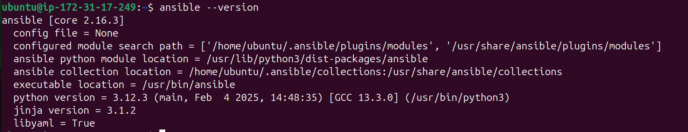
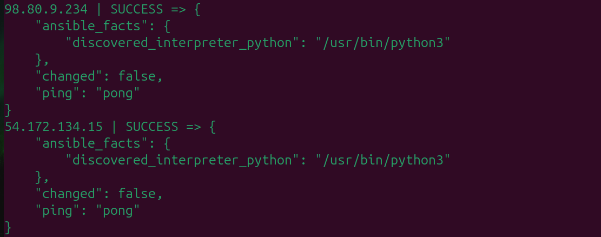

# Lab 1: Install and configure Ansible Automation Platform on control nodes, create inventories of a managed host, and then perform ad-hoc commands to check functionality.
## Prerequisites
1. Ensure Python is installed on the control node (python is must):
```
python3 --version
```
2. Update the system package manager:
```
sudo apt update  # For Ubuntu/Debian
```
3. Install pip (Python package manager):
```
sudo apt install python3-pip  # For Ubuntu/Debian
```
4. Ensure passwordless SSH access is configured between the control node and managed hosts. but when using AWS EC2 it is already configured.
## Steps
### 1. Install Ansible on the Control Node:
#### 1.1 on Ubuntu/Debian
```
sudo apt install ansible -y
```
#### 1.2 on RedHat/CentOS
```
sudo yum install ansible -y
```
#### 1.3. Verify the installation:
```
ansible --version
```
<div align="center">
  
</div>

###  2. Configure SSH Access to Managed Hosts
#### 2.1 Generate an SSH key on the control node:
```
ssh-keygen -t rsa -f ~/.ssh/ivolve-key
```
#### 2.2 Transfer the key that was created for you by AWS to the control node, so it can access the worker nodes:
```
scp -i AWS_KEY AWS_KEY  USERNAME@EC2_IP:PATH_FOR_KEY
```
- Replace EC2_IP with the intended IP address (control node ip)
- Replace AWS_KEY with the ssh key that was generated for you by AWS
- Replace USERNAME with the user to be logedin with in the control node
- Replace PATH_FOR_KEY with the path you want you key to be located
##### Example
```
scp -i lab5-key.pem lab5-key.pem  ubuntu@18.212.212.222:/home/ubuntu/.ssh/
```
#### 2.3 Transfer the generated public key from control node to worker nodes and use the aws private key to login:
```
scp -i AWS_KEY GENERATED_KEY_PUB  USERNAME@EC2_IP:PATH_FOR_KEY
```
- Replace EC2_IP with the intended IP address (worker node ip)
- Replace AWS_KEY with the ssh key that was generated for you by AWS
- Replace GENERATED_KEY_PUB with the public ssh key that you generated on the control node
- Replace USERNAME with the user to be logedin with in the worker node
- Replace PATH_FOR_KEY with the path you want you key to be located
##### Example
```
scp -i ~/.ssh/lab5-key.pem ~/.ssh/ivolve-key.pub ubuntu@54.172.134.15:/home/ubuntu/.ssh/
```
### 3. Create an Ansible Inventory File
#### 3.1. Create a directory for Ansible files:
```
mkdir ~/ansible
cd ~/ansible
```
#### 3.2. Create an inventory file:
```
vim ~/ansible/inventory
```
##### Example content for the inventory file:
```
[webservers]
webserver1 ansible_host=EC2_IP ansible_user=ubuntu ansible_ssh_private_key_file=~/.ssh/ivolve-key
[dbservers]
dbserver1 ansible_host=EC2_IP ansible_user=ubuntu ansible_ssh_private_key_file=~/.ssh/ivolve-key
```
### 4. Create an Ansible configuration file:
```
vim ~/ansible/ansible.cfg
```
##### Example content for the configuration file:
```
[defaults]
inventory = ./inventoryfile
remote_user = ubuntu
private_key_file = ~/.ssh/ivolve-key

[privilege_escalation]
become = True
become_method = sudo
become_user = root
```

### 5. Ping the managed hosts:
```
ansible all -i inventory -m ping
```
all: Targets all hosts in the inventory.
-m ping: Uses the ping module to check connectivity.
<div align="center">
  
</div>