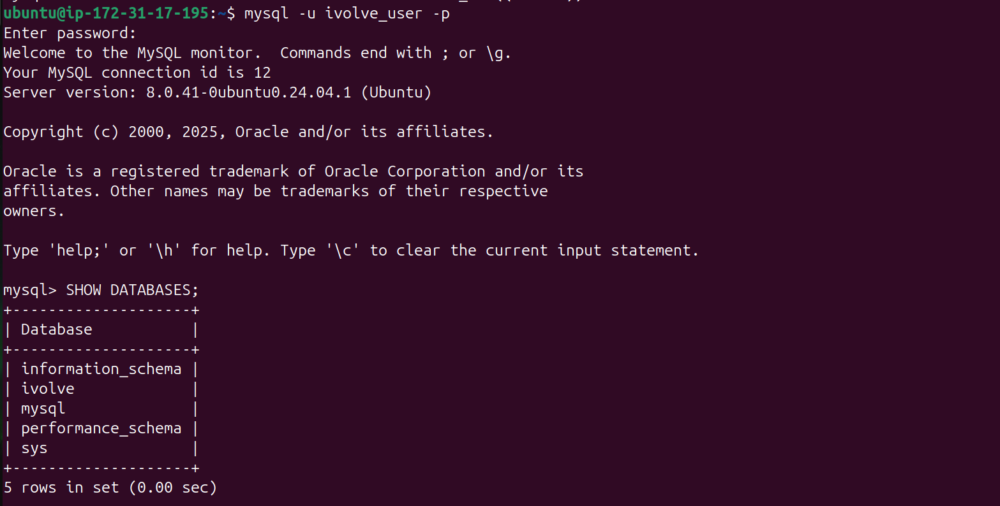

# Lab 3: Write an Ansible playbook to install MySQL, create ivovle database, create user with all privileges on ivolve DB. Use Ansible Vault to encrypt sensitive information such as database user password, and incorporate the encrypted data into an Ansible playbook.
## Steps
### 1. Set Up Inventory File:
#### 1.1. Create the inventory file
```
vim ~/ansible/inventory
```
#### 1.2. Add the following to the inventory file
```
[webservers]
webserver1 ansible_host=EC2_IP ansible_user=ubuntu ansible_ssh_private_key_file=~/.ssh/ivolve-key

[dbservers]
dbserver1 ansible_host=EC2_IP ansible_user=ubuntu ansible_ssh_private_key_file=~/.ssh/ivolve-key
```
- Replace EC2_IP with your ec2 ip addresse
### 2. Create the Vault-Encrypted File:
##### 2.1. Create the secrets.yaml file directrly from Ansible-Vault
##### 2.2. Create the secrets.yaml as a text file first then encrypt it using Ansible-Vault
#### 2.1. Create the secrets.yaml file directrly from Ansible-Vault
```
ansible-vault create secrets.yaml
```
#### 2.2. Create the secrets.yaml as a text file first then encrypt it using Ansible-Vault
```
vim ~/ansible/secrets.yaml
ansible-vault encrypt secrets.yaml
```
- Then enter password for your secrets.yaml file
#### 2.3. Add Encrypted Variables: 
```
mysql_root_password: "ivolveroot"
mysql_ivolveuser_password: "ivolveuser"
```
### 3. Save the secrets.yaml file password in a normal text file. 
#### 3.1. Create a normal text file
```
vim ~/ansible/vault-pass.txt
```
#### 3.2. Add the secrets.yaml file password in the text file
```
ivolve-vault-file-password
```
#### 3.3. Edit the ansible.cfg file to always use the vault-pass.txt as the password for the secrets.yaml file
```
[defaults]
vault_password_file = ./vault-pass.txt
```
### 4.  Write the Ansible Playbook
#### 4.1. Create the playbook file
```
vim ~/ansible/dbserver-conf.yaml
```
##### 4.2. Add the following to the playbook file:
```
- name: Install MySQL and configure ivolve database
  hosts: dbservers
  become: 'yes'
  vars_files:
    - ./secrets.yaml # Load encrypted variables from the secrets file

  tasks:
    - name: Update apt cache
      apt:
        update_cache: 'yes'

    - name: Installing Mysql and dependencies
      package:
        name: '{{item}}'
        state: present
        update_cache: 'yes'
      loop:
        - python3
        - mysql-server
        - mysql-client
        - python3-mysqldb
        - libmysqlclient-dev
          #included to ensure that any software or scripts 
          #that depend on MySQL client libraries can be built and run on the system.
      become: 'yes'

    - name: Ensure MySQL is running and enabled on boot
      service:
        name: mysql
        state: started
        enabled: 'yes'

    - name: Change MySQL root password
      mysql_user:
        name: root
        password: '{{ mysql_root_password }}'
        check_implicit_admin: 'yes' # Allows changing the root password without knowing the current one
        login_user: root
        login_password: '' # Empty password for initial setup
        login_unix_socket: /var/run/mysqld/mysqld.sock

    - name: Create ivolve database
      mysql_db:
        name: ivolve
        state: present
        login_user: root
        login_password: '{{ mysql_root_password }}'

    - name: Create user with all privileges on ivolve database
      mysql_user:
        name: ivolve_user
        password: '{{ mysql_ivolveuser_password }}'
        priv: '*.*:ALL,GRANT' # Grants ALL privileges on all databases and tables
        state: present
        login_user: root
        login_password: '{{ mysql_root_password }}'

    - name: Flush privileges
      mysql_query:
        query: FLUSH PRIVILEGES
        login_user: root
        login_password: '{{ mysql_root_password }}'
```
### 5. Test the Playbook
#### 5.1. Run the playbook in check mode :
```
ansible-playbook dbserver-conf.yaml.yml --check
```
### 6. Execute the Playbook
```
ansible-playbook dbserver-conf.yaml 
```
### 7.  Validate the Configuration
#### 7.1. Check MySQL Installation:
```
mysql --version
```
#### 7.2. Log in to the MySQL database on the target server
```
mysql -u ivolve_user -p
```
#### 7.3 Run: 
```
SHOW DATABASES;
```
<div align="center">
  
</div>
