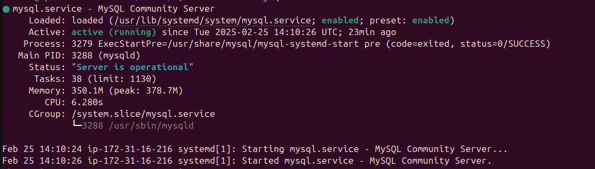

# Lab 2:  Install MYSQL and create a cron job to take backup from all databases at 5 o'clock every sunday.
## Steps
### 1. Update you ubuntu packages and install MYSQL and make sure it works 
```
sudo apt update
sudo apt install mysql-server
sudo service mysql status
```
#### 1.1. It should look like this
<div align="center">
  
</div>

### 2. Login to MYSQL as root and change the password 
```
sudo mysql -u root -p
ALTER USER 'root'@'localhost' IDENTIFIED BY 'ivolve';
```
### 3. Create the "backup" directory and give it the right permisssion
```
sudo mkdir /home/ubuntu/backups
sudo chmod 777 /home/ubuntu/backups 
```
### 4. Create the credentials file for storing the username and password of MSQL
```
vim /home/ubuntu/mysql-backup-creds
```
```
#!/bin/bash
export BACKUP_PATH="/home/ubuntu/backups"
export BACKUP_FILE="mysql-backup-$(date +"%Y%m%d_%H%M%S").sql"
export CRED_PATH="/home/ubuntu/mysql-backup-creds"
# Load credentials
source $CRED_PATH
```
### 5. Restrict access to the credencials file
```
sudo chmod 600 /home/ubuntu/mysql-backup-creds
sudo chown root:root /home/ubuntu/mysql-backup-creds
```
### 6. Create the variables file
```
vim /home/ubuntu/mysql-backup-vars
```
```
#!/bin/bash
export BACKUP_PATH="/home/ubuntu/backups"
export BACKUP_FILE="mysql-backup-$(date +"%Y%m%d_%H%M%S").sql"
export CRED_PATH="/home/ubuntu/mysql-backup-creds"
# Load credentials
source $CRED_PATH
```
### 7. Creating the backup script
```
vim /home/ubuntu/mysql-backup.sh
```
```
#!/bin/bash
# Load vars
source /home/ubuntu/mysql-backup-vars

# Take a backup of all databases
mysqldump -u $USERNAME -p $USERPASSWORD --all-databases > ${BACKUP_PATH}/$BACKUP_FILE

# Compress the backup file
gzip $BACKUP_PATH/$BACKUP_FILE

# Delete backups older than 7 days
find ${BACKUP_PATH}/ -type f -name "*.gz" -mtime +7 -delete

echo "Backup completed: $BACKUP_FILE.gz"
```
### 8. Make the script executable
```
sudo chmod +x /home/ubuntu/mysql-backup.sh
```
### 9. Create cron job to take backup from all databases at 5 o'clock every sunday
```
crontab -e
```
<div align="center">
  
</div>
