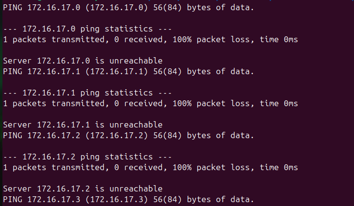

# Lab 2:  Create a shell script that would ping every single server in the 172.16.17.x subnet where x is a number between 0 and 255. If a ping succeeds, statement "Server 172.16.17.x is up and running" will be displayed. Otherwise, if a ping fails, statement "Server 172.16.17.x is unreachable" will be displayed
## Steps
### 1. Create the script
```
vim /home/ubuntu/ping-servers.sh
```
```
#!/bin/bash
##Loop and ping all servers in subnet "172.16.17.x"
for i in {0..255}; do
##Define the current IP address
  IP="172.16.17.$i"
  ping -W 1 -c 1 $IP
##check status of the server
  if [ $? -eq 0 ]; then
    echo "Server $IP is up and running"
   else
    echo "Server $IP is unreachable"
  fi
done
```
### 2. Make the script executable
```
chmod +x /home/ubuntu/ping-servers.sh
```
### 3. Run the script
```
./home/ubuntu/ping-servers.sh
```
#### 3.1 The output will look similar to :

<div align="center">
  
</div>
