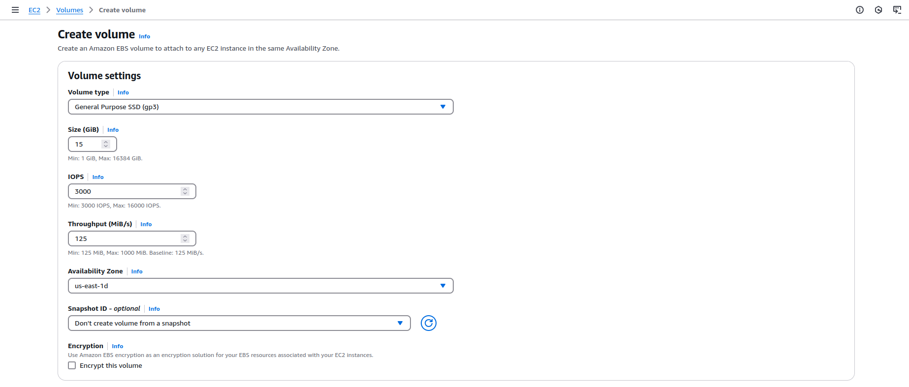
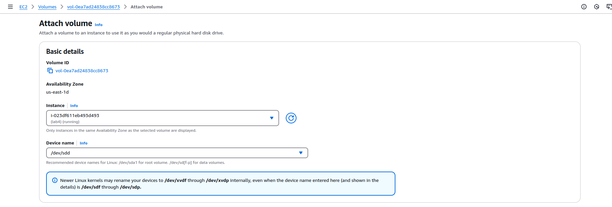
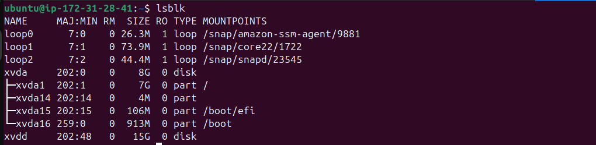
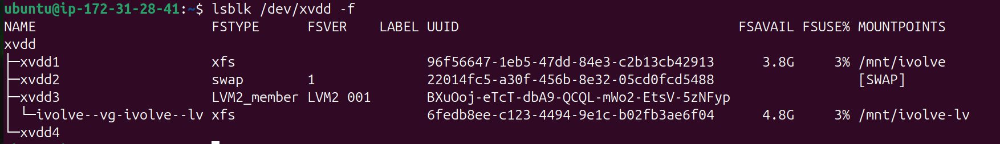
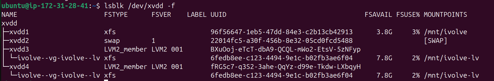

# Lab 4: Attach a 15GB disk to your VM, make 4 partitions from this disk 4GB, 2GB, 6GB, and 3GB. Use the 4GB partition as a file system, configure the 2GB partition as swap, Initialize the second 5GB as a Volume Group (VG) with a Logical Volume (LV), then extend the LV by adding the last 3GB partition.
## Steps
### 1. Create an EBS Volume:
<div align="center">
  
</div>

### 2. Attach the Volume to EC2 Instance:
<div align="center">
  
</div>
<div align="center">
  
</div>

### 3. Create partition table:
```
sudo parted /dev/xvdd mklabel gpt
```
### 4. Create all partitions:
```
sudo parted /dev/xvdd mkpart file-system-xfs xfs 1MiB 4GiB
sudo parted /dev/xvdd mkpart swap 4GiB 6GiB
sudo parted /dev/xvdd mkpart lv 6GiB 12GiB
sudo parted /dev/xvdd mkpart lv 12GiB 14.9GiB
```
#### 4.1 Checking partitions:
```
lsblk /dev/xvdd
```
### 5. Creating 4GiB file system and mount it:
```
sudo mkfs -t xfs /dev/xvdd1
sudo mkdir /mnt/ivolve
sudo mount /dev/xvdd1 /mnt/ivolve/
```
### 6. Create swap
```
sudo mkswap /dev/xvdd2
sudo swapon /dev/xvdd2
```
#### 6.1 Checking swap:
```
sudo swapon --show
```
### 7. Create logical volume and make it xfs file system and mount it
```
sudo pvcreate /dev/xvdd3
sudo vgcreate ivolve-vg /dev/xvdd3
sudo lvcreate -n ivolve-lv -L 5G ivolve-vg
sudo mkfs -t xfs /dev/ivolve-vg/ivolve-lv
sudo mkdir /mnt/ivolve-lv
sudo mount /dev/ivolve-vg/ivolve-lv /mnt/ivolve-lv/
```
<div align="center">
  
</div>

### 8. Extend the logical volume
```
sudo pvcreate /dev/xvdd4
sudo vgextend ivolve-vg /dev/xvdd4
sudo lvextend -L +3Gib /dev/ivolve-vg/ivolve-lv
sudo xfs_growfs /dev/ivolve-vg/ivolve-lv
```
<div align="center">
  
</div>

### 9. Make persistent  mounts 
```
sudo vim /etc/fstab
```
### 10. Add the following to /etc/fstab file
```
UUID="96f56647-1eb5-47dd-84e3-c2b13cb42913" /mnt/ivolve xfs defaults 0 0
UUID="6fedb8ee-c123-4494-9e1c-b02fb3ae6f04" /mnt/ivolve-lv xfs defaults 0 0
UUID="96f56647-1eb5-47dd-84e3-c2b13cb42913" none swap sw 0 0
```
Remember to change the value of UUID="96f56647-1eb5-47dd-84e3-c2b13cb42913" with your own UUID
