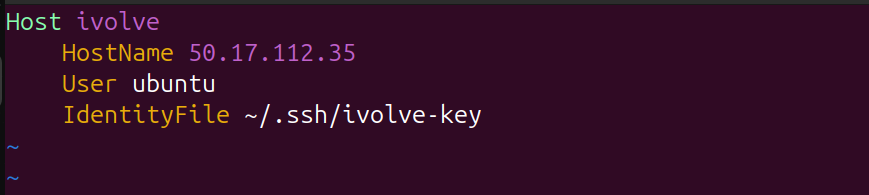

# Lab 6: Generate public and private keys and enable SSH from your machine to another VM using the key. Configure SSH to just run ‘ssh ivolve’ (amazonlinux) without specify username, IP and key in the command.
## Steps
### 1. Open a terminal on your local machine and generate an SSH key pair:
```
ssh-keygen -t rsa -f ~/.ssh/ivolve-key
```
### 2. Confirm the location of the keys:
```
ll ~/.ssh/
```
- Private key: ~/.ssh/ivolve-key
- Public key: ~/.ssh/ivolve-key.pub
### 3. Copy key from your local machine to EC2
```
scp -i lab5-key.pem ivolve-key.pub USERNAME@EC2_IP:~/.ssh/
```
- Replace USERNAME with the EC2 username.
- Replace EC2_IP with the actual IP address of the EC2.
- Replace "lab5-key.pem" with AWS generated key
#### 3.1.Example:
```
scp -i lab5-key.pem ivolve-key.pub ubuntu@50.17.112.35:/home/ubuntu/.ssh/
```
### 4. Include the public key to authorized_keys file
#### 4.1. SSH to the EC2
#### 4.2. copy the content of the public key "ivolve-key.pub" to "authorized_keys" file
```
cat ivolve-key.pub >> authorized_keys
```
#### 4.3. Now you can login with your generated key "ivolve-key"
### 5. Create "config" file in "~/.ssh/" directory to specify the information for the newly add host (Alias)
#### 5.1. Create the config file:
```
vim ~/.ssh/config
```
#### 5.2. Add the following configuration:
```
Host ivolve
    HostName EC2_IP
    User USERNAME
    IdentityFile ~/.ssh/ivolve_key
```
- Replace EC2_IP with the EC2’s IP address.
- Replace USERNAME with the EC2 username.
#### 5.3 Example:
<div align="center">
  
</div>

### 6.Test the SSH Alias
```
ssh ivolve
```

